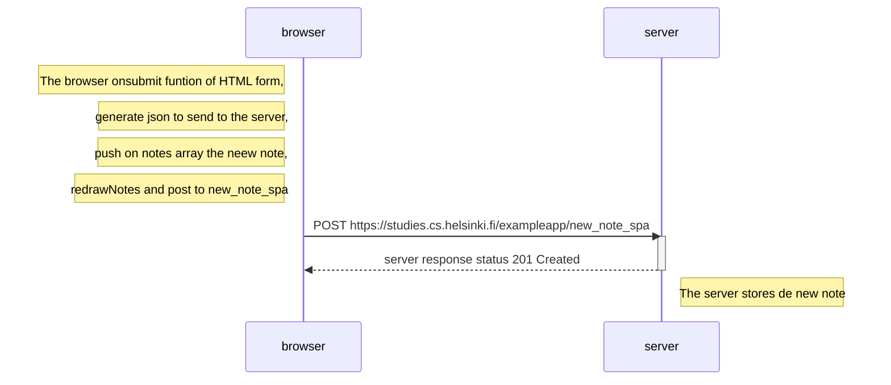

Here is the flow chart:

```mermaid
sequenceDiagram
    participant browser
    participant server

    Note left of browser: The browser onsubmit funtion of HTML form, 
    Note left of browser: generate json to send to the server,
    Note left of browser: push on notes array the neew note,
    Note left of browser: redrawNotes and post to new_note_spa

    browser->>server: POST https://studies.cs.helsinki.fi/exampleapp/new_note_spa
    activate server
    server-->>browser: server response status 201 Created
    deactivate server

    Note right of server: The server stores de new note
```
